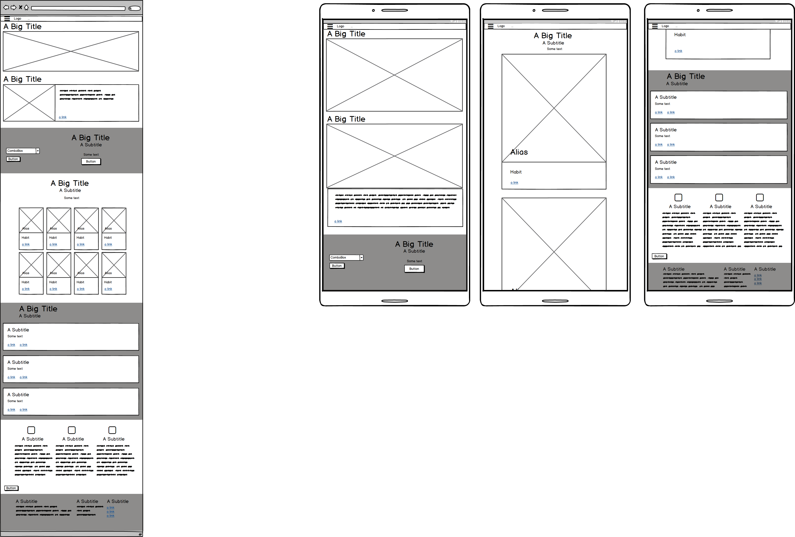

# CHANGE IS GOOD- Recovery app. 

## Aim 
Create an App to help connect still suffering addicts (users), who are searching for real life experience and advice about how to stop, with methods (recovery recipes), in the form of stories from addicts who have recovered (user/contributors). 
Both users and user/contributors will have the option to add their story. The data collected from these real life stories will be studied to determine patterns that lead to, fuel and arrest recovery. 

The term addict is used to describe the user who has a psychological and physical inability to stop consuming a chemical, drug, activity, or substance, even though it is causing psychological and physical harm.
The different types of addiction options currently added are:
1. Alcohol
2. Prescription drugs
3. Illegal drugs
4. Food
5. Sex/Porn
6. Gambling
7. Exercise
8. Obsession with health
9. Attention
10. Physical self harm
11. Toxic relationships
12. Violence
13. Social Media
14. Gaming
15. Spending
16. Horoscopes/Psychics
17. Chatlines
18. Fantasy
19. Gossip/Drama
20. Materialism/Image
21. Other

## Key value and who benefits from the development of this app- What is the point?

1. Help users looking for solutions to see stories of those who have recovered. Gain hope from human connection and a sense of community. 
2.  Help User/contributors (people who have some methods to suggest as a means to recover) stay connected while remembering how bad it was to prevent relapse. In 12 step recovery it this an essential part of maintaining good mental health and sobriety.  A recent VR study proved that helping a crying child, even in a virtual environment, improves resistant depression.
Helping others is very good for mental health. This app will provide a forum for  user/contributors helping others and for those on 12 step programs to do step 12.
3. With social services, the police force, emergency services, criminal justice system and the NHS all suffering from critically low levels of funding, this app attempts to gather data that may be useful. This data may eventually help towards greater understanding and alleviation of the costs of the disease of addiction on society. Addicts are a huge drain on all our resources but many of the treatments available currently do not work well. Any useful information
collected by this app is destined to be included in a report that will be made available without any cost to any of the services who may be helped by it. 
#### In Summary
Open communication has proven to find solutions. This app will be an open communication tool to channel information from recovered addicts to suffering addicts and organisations that provide treatment for addicts. 

## Why the idea?

The idea came from the milestone3 project guideline which suggested we make an app which stores recipes. 
The automatic thought is to develop an app which stores cooking recipes but the term recipe can apply to other structured methods.

Having myself volunteered helping alcoholics, drug addicts and sex/love addicts for almost 20 years, I know that the current treatments in place do not work for the majority of people.
New approaches are necessary but the gathering of data is currently not independent. Many of the current recovery models have been set up to support men. In particular male offenders.
The fear of social services being involved prevents many mothers from seeking the help they desperately need. This is believed to contribute to the fact that women may be more likely to go to A&E or die from overdose or other effects of certain substances.
The difficulty women with children have attending 12 step meetings or other recovery programmes reliably means fresh methods need to be developed to support these women.
Not neglecting men, many of whom state that their social anxiety prevents them in engaging with currently favoured treatment programs which are geared towards group therapy and effectively revealing all your past and inner most thoughts to an audience.

Latest studies reveal that addiction may be the direct result of lack of human connection. 
Addiction is a desperate and lonely place.
The belief that you are alone and the only one to have suffered the same experiences is the final song of many addicts who tragically die. Often leaving young children to the social care system. 
Addiction presents with the symptom of a feeling uniqueness, a sense of being special and different. Both a sense of grandiosity  and the flip side of pitifully low self esteem are often present. 
If this is not tackled this pattern of thinking will end in escalating substance use or uncontrollable behaviour. 
Prison, hospitalisation, institutions or death by suicide, accident or violence are inevitabilities of untreated addiction.

This project objectives are to 
1. Offer an environment where isolated people suffering with addiction issues can reach out. 
2. Offer a catalogue of solutions in the form of stories written by people who have beaten their addiction.
3. Offer tools to help addicts in recovery maintain their vantage point. 
3. Gather data as to what works relative to the individual circumstances, upbringing, support structure, parental/societal influences, family history and environment. Many other factors can easily be explored by presenting them within the questionnaires to gather facts of statistical significance. 

The data collected by the app can then be used to highlight patterns that lead to recovery in some sufferers yet may cause suicide and death in another.
As the database expands facts can be shown to support how, for example, 36 year old mother of 2 with an alcohol problem and a history of compulsive over achieving, chronic stress, neglect and starvation as a child recovered from an alcohol and prescription drug dependence. Her recovery may need the opposite methods to that of a 22 year old man, sexually abused as a child who is addicted to heroin since being 11.  Currently available treatments will usually lump these cases together. 

This app will filter out backgrounds and differences that are of no interest or relevance to the user. Focusing on bespoke methods that could work for them being both proven so realistic and achievable. 
Presenting the user with similarities and not differences amongst the success stories.

## UX

### User stories and anticipated preferences considered at each stage and contained within this section. 
Separate user stories section added for clarity.

### Development planes 

**The strategy plan**
##### Summary of strategy plan
1. Development focus will be to provide a service and connection for users who are trying to recover from addiction.
2. Second strategic aim is to be useful for user/contributors.
3. Third strategy will be the collection of data to help develop new methods for tackling the addiction crisis.
4. Fourth part of the strategy considered minimising the dependency on extensive admin whilst maximimising the reproduceability and authenticity of the data by validating the questions used to collect the data. 

A future goal of the project would be to analyse the data collected in a report that will be published and given free of charge to the services that may benefit from it.

##### Details of strategy plan

1. Development focus will be to provide a service and connection for users who are trying to recover from addiction or thinking about how possible it may be in the future.

Useful links, motivational quotes, images with a message will be presented throughout the app.

On the home page the user will be asked to select their type of poison (addiction)
to filter out stories that may be of no interest or help to them. 
They will be invited to  'tell you story'. Journalling, sharing your experience and finding a voice has been proven to be beneficial in all areas of mental health including recovery from addiction.
It needs to be kept short and simple for addicts who have difficulty focusing. The strategy of guided select questions was chosen to keep the addicted minds focused and engaged. 
A series of direct questions with different predetermined options in a collapsible select form is how this is tackled.
The answers to these questions will be assigned an integer which will be stored in the database so that processing the data will be simplified. 

2. Second strategic aim is to be useful for user/contributors.
User/contributors will be deemed to be those sharing their story having recovered from addiction

The contributors to the information provided to the users will be addicts in recovery who share their stories and demonstrate which methods they used to get the stay sober/clean and free of the destructive patterns that have taken over their lives.
The contributors will be asked more general questions because
- With an open forum, it is anticipated that a lot more methods may be offered for consideration that haven't been thought of previously.
- Asking specific questions and tailoring the responses will limit the collection of data to what is previously known to cause and heal addiction. A fresh approach needs to be found.
- The stories presented will appear more personal, true and relateable if they are in the contributors own words.
- The questions which provoke thought may be more engaging for the contributor so making them more likely to complete and submit the form. This is not an assumption. If we find that forms being submitted incomplete or there is a lack of interest, the content of the forms will be amended.
It is part of the strategy to research validated form designs to see if they may be relevant or necessary. This may be adapted once the app goes live as a response to feedback.
3. Third strategy will be the collection of data to help develop new methods for tackling the addiction crisis.
An example of this would be the fact that women are more likely to visit A&E or die from addiction than men. 

https://www.drugabuse.gov/publications/drugfacts/substance-use-in-women

https://www.addictioncenter.com/addiction/differences-men-women/
A recent study showed that alcoholic women who enter in to the currently available treatment programmes and attempt to get in to recovery are more likely to die than those who have not had any treatment. 
This is hypothesised to be due to the fact that all the research for the effectiveness of the currently available methods of treatment has been carried out in men. Specifically male offenders. 

A lot of help is available for crisis. A low cost strategy to tackle prevention and early intervention is needed in the hope that  helping the carer or parent it may be possible to  lower the burden on social services and stop the damage to the family unit and the dependent children. 

A strategy to focus the app on collecting data from women has been considered but not implemented so far based on the expectation that men may still use the app and the data would be distorted if we expect all the results to have been gathered from women.

The strategy has been developed considering the following accepted facts which may prove to be beneficial for mothers or men who have stressful lives with a lot of responsibility, including single fathers.

Mothers/ single fathers or carers who are isolated and looking after young children, do not feel able to engage in the currently available treatments for reasons as follows:
-  for fear of social services being involved
-  limited time
-  limited emotional and physical energy
-  risk of losing their relationship and financial support . Couples often use drugs together so when one tries to get help the other feels threatens and prevents this.

The simplicity plus 24/7 availability of the app was developed believing that 
-  the parent or carer can seek help when the children have gone to bed on their phone without the pressure of sticking to a rigorous regime.
- parents and carers may be come motivated to reach out for the help earlier. Identification/connections through reading  success stories may help them gain hope.
-Addiction is often accompanies by antisocial sleep patterns which further isolate the user and make access to help more difficult.

Part of the strategy it aimed at assessing and collecting evidence of how intervention and stopping addiction escalating, ultimately benefits addicts, their famillies, their communites and the wider society thereby evidencing that funding should shift focus towards prevention rather than cure.

Knowledge that many currently treatments available are for the later stages of addiction when the addict has become a threat to themselves or others. Little funding is available for prevention.

Strategic immediate Goals:
- To provide hope, comfort and a community for people trying to recover from addiction and isolation.
- To help mothers/carers who are too afraid to get the help they need because of the threat that their children may be removed by social services.
- Help recovered addict's well being.
- To collect data useful to the NHS, drug treatment agencies and private recovery organisations. The community interest goals of this website are aimed at prevention, early intervention and cure.

4. Fourth part of the strategy considered minimising the dependency on extensive admin whilst maximimising the reproduceability and authenticity of the data by validating the questions used to collect the data. 
Admin strategy - Editing and deleting stories which may to too graphic, false or inappropriate would be an ongoing concern. For the purpose of this project edit and delete functionality is accessed by clicking on `admin` text link positioned in the footer. Although it is considered that all data will be useful, it is not expected that all stories will be appropriate and 
genuine. It is possible that the stories may need to be authorised before being posted.  
Currently the strategy offers total anonymity and no login is required. This is expected to remain the case for the user. 
No login is deemed necessary for contributors at this point. We will be keen to gather as many recovery success stories as possible so the ease of this process will be imperative. Any barriers may limit the available information and select for a specific type of contibutor which will influence the data collected.
There is no login currently for admin as whole. There is no requirement for login to be included for the project but without having launched the app we can not predict whether this may need to be added for sure. The reasoning is that if an offensive recovery story is added it does not need to wait for authorised admin to find out and remove it.
Anyone can remove it who is offended by it. There is an appreciation that this may lead to malicious emptying of the database but while the scale of the project is still small the threat is considered small.
The strategy considers the fact that the app may prove very popular and suddenly attract a lot of stories added within a short time. Fresh data can be continuosly uploaded while keeping a balance of what is available to view on the app by adding new collections to the MongoDb and changing the python to redirect the completed forms to a new collection within the database project. We can then change between old or fresh stories viewable and keeping the data store in tact. 

**The scope plane**
Re-scoping followed feedback from tutors and my mentor. Furthermore, when I asked recovered addicts to fill in the forms I had designed they lost interest half way through which would lead to aborted efforts too often. The forms were amended and it is accepted that amendments to the questions in the forms will be ongoing.
The initial scope was ambitious and had features added, for example a diary as journalling is known to help recovering addicts.
Originally the scope included a lot of recovery information within the app but this is now selected by a series of links within the home page and in the footer. 
There were features planned that would attract people in recovery to the site to motivate them to provide their stories, for example, a gratitude list which is known to maintain good mental health in recovery.
Following research the project was simplified with additional features planned for the future at a point they are deemed necessary.

The final scope, based on information from the strategy plane and an understanding of how chaotic addicts are, is a simplified information gathering process followed by the presentation of the information in the form of:
- illustrated cards linking to individual story details. 
- Alternatively the user can generate a bespoke list using a filter drop down menu relating to their selected criteria. This is currently limited to one criteria, namely their own addiction. As the number of stories grows, I will add more filters so that the user is not over faced with too many stories to process. Currently if I add more than one filter the list generated will be empty. This will be re-scoped as the number of stories entered in to the site increases.

This project suited the MongoDB store because of it's flexibility and scalability. The agility allowing fields to vary from document to document means that is is suitable for evolving with the project. The scope of the project anticipates the need to change and react quickly, for example, the questions may need to change regularly to gather the most useful data and provide the best solutions to our users.
If the project is deemed to be useful for the recovery community it would need to scale quickly.

The scope of the project has been designed so that it is not throttled by the need for admin and processing but it can grow organically and is moderated by admin rather than stunted by it.

**The Structure plane**:. Considering what would be logical and intuitive IA- Information Architecture, the structure has been kept as simple as possible on the welcome page, considering the attention span of the users. 

#### The base.html template offers :
- Navigation bar. Link with options are 
1 **Home**- Logo designed with HOME characters. [Home page link](https://fallen-but-not-broken.herokuapp.com/index)
2 **Tell you story**  https://fallen-but-not-broken.herokuapp.com/myProblem
3 **Recovery stories** https://fallen-but-not-broken.herokuapp.com/changes
4 **Share you recovery** https://fallen-but-not-broken.herokuapp.com/add_changes
5 **Soul searching** https://fallen-but-not-broken.herokuapp.com/pastProblem
- Footer content with:
1. Admin link gives the option to add and delete contributor stories.
The edit button links to a form to update the contributor story
Edit form is sited at https://fallen-but-not-broken.herokuapp.com/deleteButton
The delete button deletes the story from the app and the data base.
2. Series of external links to relevant information proof of claims in content of site. 
#### Edit_changes.html page linked from base.html footer 
Page is sited at https://fallen-but-not-broken.herokuapp.com/edit_changes/5def8b522d1f7e0431a1a584
The page contains the change collection MongoDB data loaded and visible within a form. The data in MongoDB can be editted and saved to the database, overwriting and storing the new information when the edit button is clicked.

#### The index.html home page structure

###### Header
Setting recovery recipe concept set in materialize card. 
External link [do you have an addiction problem?](https://www.healthline.com/health/addiction/recognizing-addiction#early-signs)

###### Section
Anger/ resentment concept image and text within materialize card.
External link [resentment is a problem](https://dontjudgeyourlife.com/2016/10/07/resentment-how-it-destroys-your-mind-and-body-and-how-to-fix-it/)

###### Main section
A Materialize select form with drop down menu gives the option to choose from 21 substances or behaviours. The choice selected then filters stories that are from user/contributors with the same type of addiction. Filtering out stories of no relevance or interest to the user.

There is a second link to the 'Tell you story' form to maximise chances of data capture.
https://fallen-but-not-broken.herokuapp.com/myProblem

The main section on the home page presents all the stories stored in the data base as small cards with an image that has been pre-determinedly linked to the addiction type selection.  
The cards also list the alias provided, the name of the type of addiction and a link to the full story.
Each 'view story' link leads to the storyDetail.html page.

#### storyDetail.html page.
The page contains an individual story dependant on which link with an individual materialize card is chosen. 
Each materialize card links to a separate recovery story. The page styles the questions asked in to headings and the answers stored in changes collection in MongoDB are loaded from the database.
Examples would be :
- https://fallen-but-not-broken.herokuapp.com/storyDetail/5df29908d52ba4caf15e657d

- https://fallen-but-not-broken.herokuapp.com/storyDetail/5dfa5cdd0b8669e8b26413b9

- https://fallen-but-not-broken.herokuapp.com/storyDetail/5df11a41d7a56682a67a6337

#### myProblem.html page**Tell Your Story**- https://fallen-but-not-broken.herokuapp.com/myProblem

A Materialize select form with collapsible menu. 

Share button submits the form to the myProblem collection in the mongoDB.

#### changes.html page

**Recovery stories** https://fallen-but-not-broken.herokuapp.com/changes

List of all the contributor stories in collapsible form.
Stories retrieved from the changes collection in mongoDB. 

#### add_changes html page

**Share you recovery** https://fallen-but-not-broken.herokuapp.com/add_changes

Share your recovery experience, mistakes and all.  - A Materialize input
form with one select 'CHOOSE YOUR HABIT' option set as required so that images are input
and recovery recipe will be seen by the filter. 
'Tell you truth' button submits the form to the changes collection in the mongoDB.

#### pastProblem.html page 

**Soul searching** https://fallen-but-not-broken.herokuapp.com/pastProblem
Soul Searching -A Materialize select form with drop down menu. Currently there are 25 questions in this form. It is proposed that collection of 108 questions will be included to be of value.
Share button submits the form to the pastProblem collection in the mongoDB.

**The Skeleton plane**
The skeleton plane is currently set out as follows:

#### index.html Home page.
- A main page with links to external resources, a nav bar linking to  different forms (listed below).
Within the main page, dropdown menu offers the user the ability to filter the stories to list those most relevant to them. 
They are then presented with a list of stories they can read. 
Within the main page the story cards link to a detailed story . 
#### storyDetail.html Individual Recovery Stories. 
One recovery story per page. The main content of the page is the data stored in MongoDB which is pulled in to the grid layout.
#### changes.html  Recovery stories page
Containing a list of contributor's recoverys stories
#### add_changes.html Share your recovery page 
A page containing a simple collapsible form for the user to complete their story with prompted questions and a selction of answers. Enable the user/contributor to add contributor recovery stories.
#### pastProblem.html Soul searching form for data collection.
A page to collect in depth information about historic, recent past and current issues that may influence how, when and which treatment facilitate recovery. Individual factors are considered and the effect this may have on whether a treatment works.
#### edit_changes.html Edit recovery story page.
Recovery stories are edited in the data base by the input field entries on this form.
#### deleteButton.html List of recovery stories with option to edit or delete.

**The Surface plane**
Modern design conventions were balanced with the desire to keep the interest and focus of the user and the user/contributor, both of which are not conventional by their natures.

A unique large logo/home has been chosen for desktop following feedback to add interest to the form pages. This obscured too much of the information and did not fit the mobile design which was left with the original logo/home design.

A home page with a lot of imagery, quotes and contributor recovery stories was designed for added interest and user prolonged engagement. 
Images have been chosen to appeal to the users while presenting a simple message.
The decision was made to auto add an image chosen to reflect each type of the 21 addictions tackled on this app.
This is believed to offer a pattern to the user that is appealing and indentifiable.
The forms to complete were kept very simple. Focus to be kept on the information. The font is easy to read and the colours are muted.
A character limit to the alias has been set so that it can not extend outside the card.
The presentation of the list of stories after filtering has been kept raw. The focus is then kept on the information. 
At the point of submission we believe the story detail page has been laid out to best display the most relevant solutions and information immediately and make it obvious to the user. 
This will be adapted quickly as the questions may change and the way they are presented may not benefit the user and help the information to be absorbed.
The idea of recovery being a recipe presented to the user in text and images adds interest when it clicks. 
The surface of the app may change in the future and the hero image on the home page would be replaced if the feedback after launch suggested the recovery recipe theme idea adapted from the MS3 project idea in CI LMS proved too tenuous following future feedback.

## User stories

#### All visitors to the site will expect/want/need:

The images and text content to be interesting and bring about a positive emotional response or comforting experience. I would like to feel more informed, hopeful, connected and engaged after visiting the site which would encourage me to revisit.  

To easily find what I am looking for. I want the layout of the site to make sense so I am not confused, frustrated or bored using it.

The information I am presented with to be laid out in a way that is easy for me to navigate, so that I find what I need quickly and efficiently then return to the home page immediately. 

External links to information that will be helpful and support the claims cited in the content of the section I am in. I do not want to leave the site when I follow the links then lose the tab for the relevant original page.

As a user accessing this site from a mobile phone or tablet, I want the site to have been designed responsively so that it is still easy to navigate and use on my smaller devices. I do not want the format to change too much when I revisit it on a friends device if I am recommending it. 

#### Users suffering from addiction. 
Users may take years to come to terms with their addiction and be ready to stop. 
This user will be offered solutions in practical, real stories that they can identify with. These stories will be short and eaily digested but can spark hope in to the lives of lonely, isolated addicts who are too afraid to 

I want/need: 

Recognition that I am an individual and that I have a voice and something to offer. I can achieve this by completing my personal story. 

I want to feel understood.

I want to believe that there is an awareness that addiction takes many forms. 
Of the 21 different choices of addiction considered on the site, the choice of viewing all the stories and seeing similarities could be of interest. 
Alternatively I may want to be able to filter out all the stories that have no relevance or interest to me easily. 

Privacy while I become ready to admit and accept that I have a problem.

Anonymity so that there is no risk of upsetting parents, partners, employers, collegues or friends. 

I do not feel it is for me attending public group therapy, recovery agencies or counsellors as I have social anxiety. 

I do not feel I can attend public group therapy or recovery agencies as I may bump in to an abuser or person from my past who will pose risk to me and my family. 

Confidentiality so that I do not risk my prospects or future opportunities by seeking help through professionals and having details on my medical records. 

As a young person I believe that I have different needs, I may be more likely to accept that I am addicted to social media, gaming, self harm  and porn addiction. Possibly using alcohol and drugs to excess but not addicted YET. Maybe abusing food too.
These users can gain knowledge about their condition and hopefully prevent addictions escalating.

As a mothers I may be isolated and looking after young children who do not feel able to engage in the currently available treatments 
a) for fear of social services being involved
b) limited time
c) limited emotional and physical energy
d) risk of losing my relationship and financial support. Couples often use drugs together so when one tries to get help the other feels threatens and prevents this.
Therefore I want to be able to can seek help when the children have gone to bed on my phone, anonymously and privately without the pressure of sticking to a rigorous treatment regime.

As a mother I need to find the motivation and confidence to reach out for the help earlier. I want to feel that I am not isolated and alone. Reading success stories will help me gain hope.

As a single fathers or carers I will have the same issues as a mother, feeling isolated. Seeking connection could be helpful.

If I am introverted and shy I may veer away from the current treatments which demand face to face attendance and engagement in front of an audience.
It is possible that the available therapies favour the extroverted so I will present at the GP surgery with depression or anxiety without ever revealing the real problem.

I want to try to find ways of solving my problem independently. Information and identification with recovered addicts may help.

Because of the stigma and criminality of addiction I will not reveal to professionals the extent of my using. This has resulted in me bring misdiagnosed and treated of the wrong issue. 

Physically ill or disable people who can not leave the home easily will benefit from the ease of use of an app to support them.

Men and women who have tried the currently available treatments that have not worked. I want to see that people who have tried similar treatments, have not given up and found something that works.

Men and women who are keeping their secret and feel too ashamed to tell anyone or who are not quite ready to stop yet but are getting ready so reaearching what my help.
There is a a lot of shame attached to addiction so denial is one of the most common symptoms.

I have recognised my problem from the outset and am to the app from the earliest stages of seeking help for an addiction problem. My aim to stop the problem escalating. 

I may initially read the stories and believe I am not that bad yet but the seed is sewn.  In the meantime I may try to moderate my using or reach out and try to get support in the earlier stages of the progressive illness.

I may still be in denial and may be put off by the term addiction so the app offers habit or problem or poison as alternative term to maximise the chance of engagement.
 
I am starting the process of recovery in my mind. Coming to believe that I have not got myself down a blind ally and recovery is possible. 

I am lonely and want to feel part of a community. 

I will gain understanding, insight, awareness.

With the current problems accessing detox and rehab I am willing to try other methods when I am desperate. 

When I want information and ideas of how to get clean and sober I want them instantly. I do not want to make appointments in two weeks time. There is a small window of opportunity for me to find recovery when I am desperate. When the feeling of desperation passes me and my dependents will be sentenced to months or years of addiction before I am ready to try again. 

I do not want to spend too long filling in forms or struggle to submit them. 
 
#### The user who is also a contributor. User/contributors

I have been taught by many recovery programmes that 'you can only keep what you have by giving it away'. 
This means that when getting addiction free, I learnt that helping others is the best way of remembering how bad it was, so preventing relapse. 
When I am feeling grateful by being reminded how far I have come, I will be happier, more serene and less likely tp relapse. This means that the recovery community are motivated to be involved in anything that may help suffering addicts to get well.

I will feel part of a community.

I will feel relief that my life has changed.

I will feel useful, healthy and a sense of gratitude that is essential to maintain my current level of good mental health.

One of the key factors in getting through to addicts is for them to identify and recognise that the person trying to help them has walked in their shoes. I know this from personal experience and I want to help other addicts to recover by sharing my experience, strength and hope. 

I will have access to information and links that are interesting and add to my knowledge of my addiction. 

I will be reminded that I am taming the beast with added tools shared by other addicts. 

I want to know that my information will not be sold and that it is open source for the benefit of everyone, not for money or prestige. 

I would want to know that anyone may visit the site and complete the forms to get the benefits of gratitude and usefulness.

I do not want to spend too long filling in forms or struggle to submit them. 

I have previously found professionals and well meaning help made me more dependent as their choices become more important than my own. I felt seized by their choices for me. How can anyone who does not understand that feeling of desperation really help?

#### Professionals/Business Users 

I want clarity. I expect to be able to see that app is set out to gather an abundance of useful information to help treat addiction. 

I want to know that the information is independent, unbiased and not influenced in any way that could effect the reliability or feasibility.

I want to be able to see the questions, the consistency of answers in the stories section and how encompassing and simple to understand the questions are in the forms.  

As both providers and recipients of currently available treatment for addictions we know that, the current solutions  for this global epidemic are costly (treatment costs for e.g. The Priory hospital are £18,000 per month). Sadly most of the time the treatments and therapies for addiction are ineffective as most people struggle for year getting free from it's grip for years, spending many years in and out of detox, rehab and daytime treatment programs. The last analysis concluded that addicts need an average of 8 residential 28 stays to stop permanently. I want to see which combination of treatments or actions/change of habits prevents relapse. I can see this myself in the stories without having to wait for the report.

I want to understand why what may treat one person may kill another. Frightening studies have revealed that women who receive the currently available treatment for alcohol addiction are more likely to die than women who do not get any treatment.
David Nutt (the government advisor sacked for claiming that horse riding is more deadly than ecstasy) states that when , for example, Amy whitehouse got clean and sober, her tolerance went. As the body returns to normal in a period of abstinance the risk of relapse causing overdose increases greatly.

I want to understand which addicts may attempt suicide. 

I want to understand why an addict's mental health may initially deteriorate when they get clean.

As a professional involved in treating addiction, I would benefit from being a recipients of the data and or the final report. 

As an academic I would want to know that the collection of data has not been limited by sex, sexual orientation, creed, religion, lack or religion. 
Anything that diminished the potential accuracy and usefulness of the collected data was eradicated. This has been considered when setting out the questions.

Because of the stigma and criminality of addiction I am aware that addicts will lie to me. Rarely revealing the extent of their using until they are in crisis. This has resulted in me misdiagnosing and treating the wrong issue. 
For example, a patient who is smoking large amounts of undeclared crack cocaine but presents at the doctors with insomnia and associated anxiety will be mistakenly treated with sleeping tablets. If the real problems is not tackled recovery is impossible. 

Currently most treatments available for drug addicts involve more drugs. This has been likened to offering a drowing man a drink of water. 

The more information from people who recovered the better the chances will be of finding a recipe tailored to the specific needs and circumstances of a patient.  

The data collected will reveal whether or not there is a more effective method of treating addiciton without the need for prohibitely expensive studies which the NHS can not afford and the drug companies or treatment centres will avoid in case the findings risk disproving their effectiveness.

Addicts will explain it is easy to get clean but staying clean is the battle. We need more informatin to give to addicts to help stop them relapsing. 

With the dwindling availabilty of funding to treat addiction and mental health, open source validated evidence, gathered and made readily available could be a real help.

The current treatment programmes demand commitment that is unachievebale and unaffordable for normal life so are reserved for people in crisis rather than tackling the problem early. I want to be able to offer prevention and healing before crisis.

Early intervention can help stop issues escalating and prevent huge costs to the addict and the people around them including families, work places, social service, the NHS, the emergency services, hospitals and the criminal justice system.

Addiction is a progressive illness, left untreated most likely outcome will be prisons, institutions and  death by direct consequences, accident or suicide. Offering realistic, achievable strategies to people will be a valuable asset.

I work in A&E at anyone time we have numerous addicts waiting to be treated. Ambulance and medical resources would benefit from anything that may help. 

### Conclusion from third party comments.

People who are suffering from addiction, self destructive habits or problems with a substance or activity, have been asked whether or not this app could help. 
The response of 100% people asked, who have current addictions to exercise, gaming, social media, alcohol, prescription and illegal drugs without exception fed back that this app will be useful. Feeback comments included exciting, amazing, impressive, interesting and realistic.

Users and User/contributors  have been asked for their opinion during development. Specifically focussing on the questions in the forms. Questions have been amended to maximise engagement and submisson of the forms. 

Academics have been asked whether this could be useful and how development should be shaped. Their guidance was considered throughout.

Professionals have been asked about the potential benefits to them and asked what their thoughts were . all this has been included in user stories. 

reassuring 

## How to use QUICK GUIDE 
-  Users will be invited to  'TELL YOU STORY'. A link in the nav bar and a button within the home page direct the user to the 'tell your story' form.
Data is stored in MongoDB
A simple form guides the user through a series of questions using select options to make the process effortless.

2. - Users can use a dropdown to filter and find stories written by people with a similar problem habit or addiction to their own. 
Depending on how the questions are answered the user is presented with a series of stories from the data base written by addicts who are (12 months being considered as time frame) free from dependence. 
 3. The whole collection of user stories, that have been gathered and inputted during development of the app initally will be presented.
 If the user clicks on the view story link in the card they will be presented with a recovery recipe of all the information held for that user story.  
4. A contributor fills in their story using the link 'share you recovery in the nav bar. 
when they submit the form it is added to the mongoDB and then displayed on the app as cards on the home page and within a list found by clicking on recovery stories in the nav bar

 provides the ingredients and this app presents the method to get to their tailored recovery recipe from the database. 
but then the additional stries to be added by clicking

### Features
- Nav bar
- Grid of recovered user recipes (maybe with images/maybe not)
- side bar with the questions user is presented to answer. 
- search bar to add key words linking to user recipes for recovery
- both side bar and search bar load stories relevant to user input. 

journalling link stuff proven to help addiction 
telephone, meditation, ditching anger, blane and resentment, forgiveness or understadning opp perspective

Future feaytres
Gratitude list
recovery diaries
planners
chatroom
conferencing 
VR and videos and fell good music
audio and or video shares
filter for more 
more filters for thw 
email us
pagination
pop up saying thank you or a new page
women section
required field pop up warning for add_changes

defensive planning

# 404 error page
# @app.errorhandler(404)
# def page_not_found(e):
#     return render_template('pages/404.html'), 404

filter choses two or more types of addiction, also further filters 
One of the key factors in getting through to addicts is for them to identify and recongnise that the person trying to help them has walked in their shoes.
As the stories become more plentiful a second filter can be added e.g. sex or age or education or stress levels or social anxiety, the list is endless. 

user /contribtuor stories I will have access to a gratitude list and journal which may help me 

As a user I expect feedback from the website I am using when I interact with it, I expect loading spinners when pages are taking a while to load, I expect pop ups and modals to inform
 me when my forms have been completed and sent correctly.

I want to know that my information will not be sold and that it is open source for the benefit of everyone, not for money or prestige. 

It may be that the focus of this app becomes the collection of data for women because all the available currently therapies have been researched soley in men.

The information will be complied in to report that will be freely available. Not sold for money or prestige. 

### Wireframes

### tech intend using
1. HTML- This was used to create the markupl
2. CSS -This was used to style the elements of the HTML code
3. MATERIALIZE -HTML forms and nav bar, buttons etc.
4. PYTHON 3, PIP and Pypi libraries
5. FLASK FRAMEWORK.
6. MONGO DB ATLAS for database
7. GITPOD IDE 
8. HEROKU deployment
9. GITHUB - used for version control
10. VSC used to help format and beautify the code using extensions. Also as a back up IDE when internet access was limited.
11. GIMP -This was used for resizing, cropping, fading and changing images to fit the site.
12. PHOTOSHOP -->
13. FAVICON

Jquery
-https://code.jquery.com/jquery-3.3.1.slim.min.js"> -This added functionality to the site e.g. naivation toggle.
js materilaize

-Hover
- https://cdnjs.cloudflare.com/ajax/libs/hover.css/2.3.1/css/hover-min.css - This was used to have the hover styles run smoothly

### Testing
1. Chrome Devtools
2. HTML Validator
3. CSS VALIDATOR
4. HTML AND CSS Beautifier use format selection in beautify code
5. Javascript Validator
6. Markdown live-preview -
-Markdown live preview - https://markdownlivepreview.com/ -This project used markdown previewer to check the rendering of the readme.md file content.
This project used markdown previewer to check the rendering of the readme.md file content.
7. AutoPrefixer -This project used AutoPrefixer to make sure the css code is valid for all browsers.
-AutoPrefixer - https://autoprefixer.github.io/ -This project used AutoPrefixer to make sure the css code is valid for all browsers.

8. JASMINE- framework for testing javascript code.

testing of ceoncept -ask other users
addicts, slack etc

problems listed in the terminal were at one point 89. now 9 problems with no warnings
the problems includes indentation, trailing white space, line too long , unused variables, imported but unused files, the pep8 list of errors from pep8 online replicated the problems and warnings in the terminal.
when trying to fix the line too long issue one problem created another when amended.
VSC code extensions
PEP8 online
Check your code for PEP8 requirements
Check results 
Save 
Share
Code	Line	Column	Text
E302	19	1	expected 2 blank lines, found 1
E128	24	5	continuation line under-indented for visual indent
E302	27	1	expected 2 blank lines, found 1
W291	30	47	trailing whitespace
E128	31	9	continuation line under-indented for visual indent
E251	31	16	unexpected spaces around keyword / parameter equals
E501	42	80	line too long (80 > 79 characters)
E501	49	80	line too long (85 > 79 characters)
E303	60	1	too many blank lines (3)
E302	61	1	expected 2 blank lines, found 3
E501	65	80	line too long (94 > 79 characters)
E302	67	1	expected 2 blank lines, found 1
E128	71	5	continuation line under-indented for visual indent
E302	91	1	expected 2 blank lines, found 1
E501	108	80	line too long (85 > 79 characters)
E302	116	1	expected 2 blank lines, found 1
E501	119	80	line too long (91 > 79 characters)

ipad pro is not looking good 

9. HEROKU
python tests

## Version control

