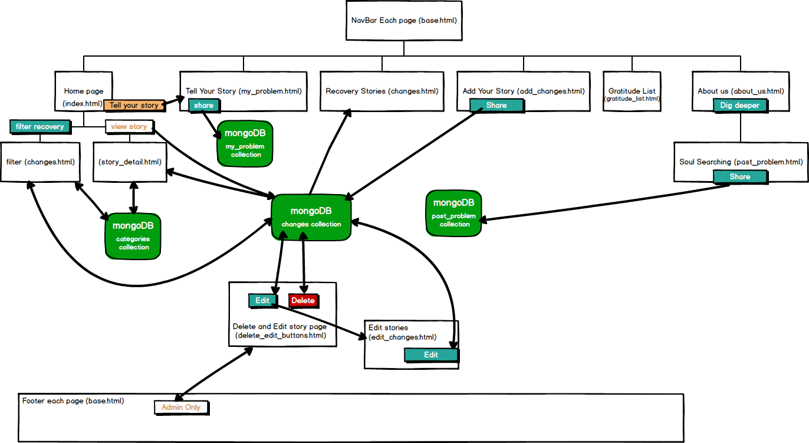
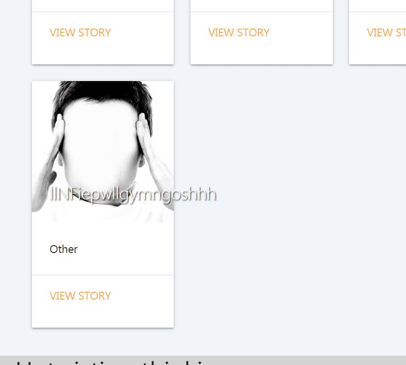
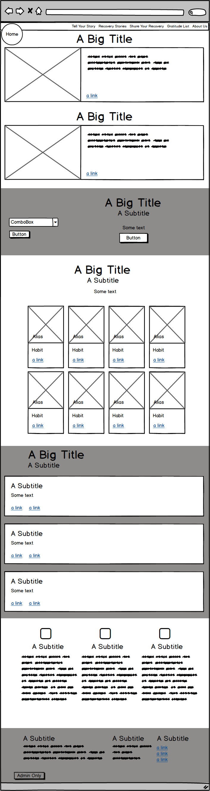

# Recipes for Recovery (r4r)- Rehabilitation app. 

[Link to Milestone Project 3](https://fallen-but-not-broken.herokuapp.com/)

## A new recovery app 

- The **Recipes for Recovery (r4r)** app connects people with an addiction problem with others who have the solution.


## Aim 
Create an App to help connect still suffering addicts (users), who are searching for real life experience and advice about how to stop, with methods (recovery recipes), in the form of stories from addicts who have recovered (user/contributors). 
Both users and user/contributors will have the option to add their story. The data collected from these real life stories will be studied to determine patterns that lead to, fuel and arrest recovery. 

The term addict is used to describe the user who has a psychological and physical inability to stop consuming a chemical, drug, activity, or substance, even though it is causing psychological and physical harm.
The different types of addiction options currently added are:
1. Alcohol
2. Prescription drugs
3. Illegal drugs
4. Food
5. Sex/Porn
6. Gambling
7. Exercise
8. Obsession with health
9. Attention
10. Physical self harm
11. Toxic relationships
12. Violence
13. Social Media
14. Gaming
15. Spending
16. Horoscopes/Psychics
17. Chatlines
18. Fantasy
19. Gossip/Drama
20. Materialism/Image
21. Other

## Quick guide

- **Tell your story** invites users to do just that. 
- **Recovery Stories** links to step by step solution/identification guide presented as a list of collapsible questions and answers.
- **Share you recovery** links to a form for contributors to create a recovery story. 
- Once shared each recovery story is presented in three formats
    1. Within the list of recovery stories
    2. On home page as a small card with image, alias amd addiction type.
    3. A single story is presented on a single page following the view story link in each card on the home page.
- **Soul searching** links to an extensive survey questionnaire to gather data. 
- From the **admin only** link in the footer recovery stories can be edited or deleted.
- **A gratitude list** is offered as a tool for contributors. 

### Project purpose

- Help addicts (user) recover
- Help addicts (user/contributors) who have recovered to feel gratitude. Gratitude and helping others promotes good mental health and less likelihood of relapse.
- Collect data that may be useful towards improving recovery rates. 

## UX

### User stories

#### All visitors to the site will expect/want/need:

- The images and text content to be interesting and bring about a positive emotional response or interesting experience. 
- To feel more informed, postive, connected and engaged after visiting the site.
- To easily find what I am looking for. I want the layout of the site to make sense so I am not confused, frustrated or bored using it.
- The information I am presented with to be laid out in a way that is easy for me to navigate, so that I find what I need quickly and efficiently then return to the home page immediately. 
- External links to information that will be helpful and support the claims cited in the content of the section I am in to alleviate doubts. 
- I do not want to leave the site when I follow the links then lose the tab for the relevant original page.
- As a user accessing this site from a mobile phone or tablet, I want the site to have been designed responsively so that it is still easy to navigate and use on my smaller devices. 
- I do not want the format to change too much when I revisit it on a friends device if I am recommending it. 

#### Users suffering from addiction will expect/want/need:
- I am often agitated so do not want to spend too long filling in forms or struggle to submit them. 
- I am lonely and want to feel part of a community. 
- I need to gain understanding, insight, awareness in to my addiction.
- With the current problems accessing detox and rehab I am willing to try other methods when I am desperate. 
- When I want information and ideas of how to get clean and sober I want them instantly. I do not want to make appointments in two weeks time.  
- I need recognition that I am an individual and that I have a voice and something to offer. I can achieve this by completing my personal story. 
- I want to feel understood, connected and hope.
- I want to believe that there is an awareness that addiction takes many forms. 
- I may want to be able to filter out all the stories that have no relevance or interest to me easily. OR
- I may be interested to learn that of the 21 addictions featured the method of recovery, feelings and distress are similar.
- Privacy while I become ready to admit and accept that I have a problem.
- Anonymity so that there is no risk of upsetting parents, partners, employers, collegues or friends. 
- If I have social anxiety, the current recovery options that are widely avaiable will be a struggle for me, for example group therapy or 12 step meetings.
- I have tried recovery agencies, meidcal professionals or counsellors but their way does not work for me. 
- I do not feel I can attend public group therapy or recovery agencies as I may bump in to an abuser or person from my past who will pose risk to me and my family. 
- Confidentiality so that I do not risk my prospects or future opportunities by seeking help through professionals and having details on my medical records. 
- As a young person I believe that I have different needs, I may be more likely to accept that I am addicted to social media, gaming, self harm  and porn addiction. 
- I am not ready to stop yet but seeing recovery stories makes me believe it will be possible one day.
- As a parent or carer I may be isolated and looking after young children or vulnerable adults so I do not feel able to engage in the currently available treatments 
1. for fear of social services being involved
2. limited time
3. limited emotional and physical energy
4. risk of losing my relationship and financial support. My partner prefers me as I am and I don't want to rock the boat. 
- As a parent or carer I need to be able to:
1. Get help when my dependants are in bed or gone to school/day care.
2. I need to seek help anonymously and privately without the pressure of sticking to a rigorous treatment regime.
3. I need to find the motivation and confidence to reach out for the help earlier. 
4. I want to feel that I am not isolated and alone. Reading success stories will help me gain hope.
5. I will feel very alone and seeking connection could be helpful.
- If I am introverted and shy I may veer away from the current treatments which demand face to face attendance and engagement in front of an audience.
- I feel that available therapies favour the extroverted so I will present at the GP surgery with depression or anxiety without ever revealing the real problem.
- I want to try to find ways of solving my problem independently. Information and identification with recovered addicts may help.
- Because of the stigma and criminality of addiction I will not reveal to professionals the extent of my using. This has resulted in me bring misdiagnosed and treated of the wrong issue. 
- If I am Physically ill or disabled I can not leave the home easily will benefit from the ease of use of an app to support me.
- If I live in a rural or isolated part of the world I many only access intervention when I am in crisis. 
- Me and my friends have tried to get in to recovery countless times I have given up on the available treatments that have not worked. 
- I want to see how others have done it because I do not know anyone who has got clean. All my friends use too.
- I feel so ashamed. I could never admit to myself that it is a real problem for me I need to see similarities in stories to bust my denial.
- I have recognised my problem from the outset and am to the app from the earliest stages of seeking help for an addiction problem. 
- My aim is to stop the problem escalating. 
- I may initially read the stories and believe I am not that bad yet the seed is sewn.  In the meantime I may try to moderate my using or reach out and try to get support in the earlier stages of the progressive illness.
- I may still be in denial and may be put off by the term addiction so the app offers habit or problem or poison as alternative term to maximise the chance of engagement.
- I am starting the process of recovery in my mind. Coming to believe that I have not got myself down a blind ally and recovery is possible. 
- In summary, I want it but I want it on my terms and now. I want to hear this from someone who has walked in my shoes.

#### The user who is also a contributor. User/contributors
- I have been taught by many recovery programmes that 'you can only keep what you have by giving it away'. 
This means that when getting addiction free, I learnt that helping others is the best way of remembering how bad it was, so preventing relapse. 
- When I write about how bad it was I feel gratitude and relief. 
- I feel grateful by being reminded how far I have come, 
- When I remember how far I have come I will be happier, more serene and less likely tp relapse. 
- As a recovered addict and recovery community I am motivated to be involved in anything that may help suffering addicts to get well.
- I need to feel part of a community.
- I need to feel relief that my life has changed.
- I need to feel useful, healthy and a sense of gratitude that is essential to maintain my current level of good mental health.
- I want to help other addicts to recover by sharing my experience, strength and hope. 
- I beneift from access to information and links that are interesting and add to my knowledge of my addiction. 
- I will be reminded that I am taming the beast with added tools shared by other addicts. 
- I want to know that my information will not be sold and that it is open source for the benefit of everyone, not for money or prestige. 
- I would want to know that anyone may visit the site and complete the forms to get the benefits of gratitude and usefulness.
- I do not want to spend too long filling in forms or struggle to submit them. 
- I have previously found professionals and well meaning help made me more dependent as their choices become more important than my own. 
- I have seen the faiings of currently available treatments and would like to support data collection to help develop new strategies.
- I felt seized by the choices made by professionals for me. How can anyone who does not understand that feeling of desperation really help?

#### Professionals/Business Users 

- I expect to be able to see that the app is set out to provide and gather an abundance of useful information to help treat addiction. 
- I want to know that the information is current, independent, unbiased and not influenced in any way that could effect the reliability or feasibility.
- I want to be able to see the questions, the consistency of answers in the stories section and how encompassing and simple to understand the questions are in the forms.  
- As a providers of currently available treatment for addictions I know that, the current solutions  for this global epidemic are costly (treatment costs for e.g. The Priory hospital are £18,000 per month). Depsite this high cost, I see that most of the time the treatments and therapies for addiction are ineffective. I want information from recovered addicts to be able to offer different solution strategies.
- I want to understand why/what will treat one person yet kill another. What are people who recover doing differently? is thier background relevant to which strategy to use to treat them?
- Frightening studies have revealed that women who receive the currently available treatment for alcohol addiction are more likely to die than women who do not get any treatment.
David Nutt (the government advisor sacked for claiming that horse riding is more deadly than ecstasy) states that when , for example, Amy whitehouse got clean and sober, her tolerance went. I need data to understand why this is happening?
- I see most addicts struggling for many years in and out of detox, rehab and daytime treatment programs. The last analysis concluded that addicts need an average of 8 residential 28 stays to stop permanently. I want to see which combination of treatments or actions/change of habits prevents relapse. 
- I want to understand which addicts may attempt suicide to help me manage the risks.
- I want to understand why an addict's mental health may initially deteriorate when they get clean.
- As a professional involved in treating addiction, I would benefit from being a recipients of the data collected. 
- As an academic I would want to know that the collection of data has not been limited by sex, sexual orientation, creed, religion, lack or religion. 
- Anything that diminished the potential accuracy and usefulness of the collected data was eradicated. i want to see that this has been considered when setting out the questions.
- Because of the stigma and criminality of addiction I am aware that addicts will lie to me. Rarely revealing the extent of their using until they are in crisis. This has resulted in me misdiagnosing and treating the wrong issue. 
For example, a patient who is smoking large amounts of undeclared crack cocaine but presents at the doctors with insomnia theefore be mistakenly treated with sleeping tablets. If the real problems is not tackled recovery is impossible. 
- Currently most treatments available for drug addicts involve more drugs. This has been likened to offering a drowing man a drink of water. 
- The more information from people who recovered the better the chances will be of finding a recipe tailored to the specific needs and circumstances of a patient.  
- The data collected will reveal whether or not there is a more effective method of treating addiciton without the need for prohibitely expensive studies which the NHS can not afford and the drug companies or treatment centres will avoid in case the findings are unfavourable to them.
- Addicts will explain it is easy to get clean but staying clean is the battle. We need more informatin to give to addicts to help stop them relapsing. 
- With the dwindling availabilty of funding to treat addiction and mental health, validated evidence, gathered and made readily available could be a real help.
- The current treatment programmes demand commitment that is unachievebale and unaffordable for normal life so are reserved for people in crisis rather than tackling the problem early. I want to be able to offer prevention and healing before crisis.
- Early intervention can help stop issues escalating and prevent huge costs to the addict and the people around them including families, work places, social service, the NHS, the emergency services, hospitals and the criminal justice system.
- Addiction is a progressive illness, left untreated most likely outcome will be prisons, institutions and  death by direct consequences, accident or suicide. I want data to be able to Offer realistic, achievable strategies to patients.
- I work in A&E at anyone time we have numerous addicts waiting to be treated. Ambulance and medical resources would benefit from anything that may help. 

### Feedback and  comments from user groups.

People who are suffering from addiction, self destructive habits or problems with a substance or activity, have been asked whether or not this app could help. 
The response of 100% people asked, who have current addictions to exercise, gaming, social media, alcohol, prescription and illegal drugs without exception fed back that this app will be useful. 
Feeback comments included exciting, amazing, impressive, interesting and realistic.

Users and User/contributors  have been asked for their opinion during development. Specifically focussing on the questions in the forms. Questions have been amended to maximise engagement and submisson of the forms. 

Academics have been asked whether this could be useful and how development should be shaped. Their guidance was considered throughout.

Professionals have been asked about the potential benefits to them and asked what their thoughts were . All this has been included in user stories. 

### Development planes 

#### **The strategy plane**

##### Summary of strategy plane
1. Development focus will be to provide a service and connection for users who are trying to recover from addiction.
2. Second strategic aim is to be useful for user/contributors.
3. Third strategy will be the collection of data to help develop new methods for tackling the addiction crisis.
4. Fourth part of the strategy considered minimising the dependency on extensive admin whilst maximimising the reproduceability and authenticity of the data by validating the questions used to collect the data. 
5. Future Strategies.

A future goal of the project would be to analyse the data collected in a report that will be published and given free of charge to the services that may benefit from it.

Open communication has proven to find solutions. This app will be an open communication tool to channel information from recovered addicts to suffering addicts and organisations that provide treatment for addicts. 

Users may take years to come to terms with their addiction and be ready to stop. 
This user will be offered solutions in practical, real stories that they can identify with. These stories will be short and eaily digested but can spark hope in to the lives of lonely, isolated addicts who are afraid of living life stripped of their crutch

A simple form guides the user through a series of questions using select options to make the process effortless.

##### Details of strategy plane

1. Development focus will be to provide a service and connection for users who are trying to recover from addiction or thinking about how possible it may be in the future.

Useful links, motivational quotes, images with a message will be presented throughout the app.

On the home page the user will be asked to select their type of poison (addiction)
to filter out stories that may be of no interest or help to them. 
They will be invited to  'tell you story'. Journalling, sharing your experience and finding a voice has been proven to be beneficial in all areas of mental health including recovery from addiction.
It needs to be kept short and simple for addicts who have difficulty focusing. The strategy of guided select questions was chosen to keep the addicted minds focused and engaged. 
A series of direct questions with different predetermined options in a collapsible select form is how this is tackled.
The answers to these questions will be assigned an integer which will be stored in the database so that processing the data will be simplified. 

2. Second strategic aim is to be useful for user/contributors.
User/contributors will be deemed to be those sharing their story having recovered from addiction

The contributors to the information provided to the users will be addicts in recovery who share their stories and demonstrate which methods they used to get the stay sober/clean and free of the destructive patterns that have taken over their lives.
The contributors will be asked more general questions because
- With an open forum, it is anticipated that a lot more methods may be offered for consideration that haven't been thought of previously.
- Asking specific questions and tailoring the responses will limit the collection of data to what is previously known to cause and heal addiction. A fresh approach needs to be found.
- The stories presented will appear more personal, true and relateable if they are in the contributors own words.
- The questions which provoke thought may be more engaging for the contributor so making them more likely to complete and submit the form. This is not an assumption. If we find that forms being submitted incomplete or there is a lack of interest, the content of the forms will be amended.
It is part of the strategy to research validated form designs to see if they may be relevant or necessary. This may be adapted once the app goes live as a response to feedback.
3. Third strategy will be the collection of data to help develop new methods for tackling the addiction crisis.
An example of this would be the fact that women are more likely to visit A&E or die from addiction than men. 
Evidence should be provided for all claims made:

[Sex and gender differences in substance use](https://www.drugabuse.gov/publications/drugfacts/substance-use-in-women)

[What Are the Differences in Addiction Between Men and Women?](https://www.addictioncenter.com/addiction/differences-men-women/)

A recent study showed that alcoholic women who enter in to the currently available treatment programmes and attempt to get in to recovery are more likely to die than those who have not had any treatment. 
This is hypothesised to be due to the fact that all the research for the effectiveness of the currently available methods of treatment has been carried out in men. Specifically male offenders. 

A strategy to focus the app on collecting data from women has been considered but not implemented so far based on the expectation that men may still use the app and the data would be distorted if we expect all the results to have been gathered from women.
The simplicity plus 24/7 availability of the app was developed believing that 
-  the parent or carer can seek help when the children have gone to bed on their phone without the pressure of sticking to a rigorous regime.
- parents and carers may be come motivated to reach out for the help earlier. Identification/connections through reading  success stories may help them gain hope.
-Addiction is often accompanies by antisocial sleep patterns which further isolate the user and make access to help more difficult.

Part of the strategy it aimed at assessing and collecting evidence of how intervention and stopping addiction escalating, ultimately benefits addicts, their famillies, their communites and the wider society thereby evidencing that funding should shift focus towards prevention rather than cure.

Knowledge that many currently treatments available are for the later stages of addiction when the addict has become a threat to themselves or others. Little funding is available for prevention.

Strategic immediate Goals:
- To provide hope, comfort and a community for people trying to recover from addiction and isolation.
- To help mothers/carers who are too afraid to get the help they need because of the threat that their children may be removed by social services.
- Help recovered addict's well being.
- To collect data useful to the NHS, drug treatment agencies and private recovery organisations. The community interest goals of this website are aimed at prevention, early intervention and cure.
A lot of help is available for crisis. A low cost strategy to tackle prevention and early intervention is needed in the hope that  helping the carer or parent it may be possible to  lower the burden on social services and stop the damage to the family unit and the dependent children. 

4. Fourth part of the strategy considered minimising the dependency on extensive admin whilst maximimising the reproduceability and authenticity of the data by validating the questions used to collect the data. 

Admin strategy - Editing and deleting stories which may to too graphic, false or inappropriate would be an ongoing concern. For the purpose of this project edit and delete functionality is accessed by clicking on `admin` text link positioned in the footer. Although it is considered that all data will be useful, it is not expected that all stories will be appropriate and 
genuine. It is possible that the stories may need to be authorised before being posted.  
Currently the strategy offers total anonymity and no login is required. This is expected to remain the case for the user. 
No login is deemed necessary for contributors at this point. We will be keen to gather as many recovery success stories as possible so the ease of this process will be imperative. Any barriers may limit the available information and select for a specific type of contibutor which will influence the data collected.
There is no login currently for admin as whole. There is no requirement for login to be included for the project but without having launched the app we can not predict whether this may need to be added for sure. The reasoning is that if an offensive recovery story is added it does not need to wait for authorised admin to find out and remove it.
Anyone can remove it who is offended by it. There is an appreciation that this may lead to malicious emptying of the database but while the scale of the project is still small the threat is considered small.

The strategy considers the fact that the app may prove very popular and suddenly attract a lot of stories added within a short time. Fresh data can be continuosly uploaded while keeping a balance of what is available to view on the app by adding new collections to the MongoDb and changing the python to redirect the completed forms to a new collection within the database project. We can then change between old or fresh stories viewable and keeping the data store in tact. 

If the app proves to be useful, the strategy would be similar to trip advisor whereby a user can visit the site and see all the stories but to add their story to be included within recovery stories they would be required to login. 

5. Strategic Future Goals:
- Analysis of the data collected.
- Making the data collected freely available.
- To gather information that has the potential to decrease the burden of the cost of addiction on families, communities and society.
= To gather information in different countries to help worldwide.
- To help save lives. 


#### **The scope plane**

Re-scoping followed feedback from tutors and my mentor. Furthermore, when I asked recovered addicts to fill in the forms I had designed they lost interest half way through which would lead to aborted efforts too often. The forms were amended and it is accepted that amendments to the questions in the forms will be ongoing.
The initial scope was ambitious and had features added, for example a diary, because journalling is known to help recovering addicts.
Originally the scope included a lot of recovery information within the app but this is now selected by a series of links within the home page and in the footer. 
There were features planned that would attract people in recovery to the site to motivate them to provide their stories, for example, a gratitude list which is known to maintain good mental health in recovery.
Following research the project was simplified with additional features planned for the future at a point they are deemed necessary.

The final scope, based on information from the strategy plane and an understanding of how chaotic addicts are, is a simplified information gathering process followed by the presentation of the information in the form of:
- illustrated cards linking to individual story details. 
- Alternatively the user can generate a bespoke list using a filter drop down menu relating to their selected criteria. This is currently limited to one criteria, namely their own addiction. As the number of stories grows, I will add more filters so that the user is not over faced with too many stories to process. Currently if I add more than one filter the list generated will be empty. This will be re-scoped as the number of stories entered in to the site increases.


This project suited the MongoDB store because of it's flexibility and scalability. The agility allowing fields to vary from document to document means that is is suitable for evolving with the project. The scope of the project anticipates the need to change and react quickly, for example, the questions may need to change regularly to gather the most useful data and provide the best solutions to our users.
If the project is deemed to be useful for the recovery community it would need to scale quickly.

The scope of the project has been designed so that it is not throttled by the need for admin and processing but it can grow organically and is moderated by admin rather than stunted by it.


#### **The Structure plane**

Considering what would be logical and intuitive IA (Information Architecture), the structure has been kept as simple as possible on the welcome page, with awarenes of the short attention span of the users. 
Information Architecture has been implemented to create usable content structures, out of what was needed to satisfy the two different types of user with two different sets of informations. 
To achieve this, user centered design methods, such as usability tests, user/contributor research and profile creation, and user flow diagrams. 
Information architecture is just a small part of the User Experience but imperative to achieve the functionality without either users or user/contributors losing interest and leaving the site.


___________________________________________________________________________________________________________________

#####  Base.html template: 
The base.html navbar is loaded at the top of each page. The base.html footer appears at the bottom of each page. 

- Navigation bar links:

1. **Home**- Logo designed with HOME text characters to help guide users. [Home page](http://fallen-but-not-broken.herokuapp.com/)
2. **Tell your story**  [Tell your story](https://fallen-but-not-broken.herokuapp.com/my_problem)
3. **Recovery stories** [Recovery stories](https://fallen-but-not-broken.herokuapp.com/changes)
4. **Share you recovery** [Share your recovery ](https://fallen-but-not-broken.herokuapp.com/add_changes)
5. **Gratitude List** [Gratitude List](https://fallen-but-not-broken.herokuapp.com/gratitude_list)
6. **About Us** [About Us](http://fallen-but-not-broken.herokuapp.com/about_us)

- Footer content:

1. Series of external links to relevant information/proof of claims in content of site. 
2. **admin only** link gives the option to edit and delete contributor stories.
[Edit and delete buttons](https://fallen-but-not-broken.herokuapp.com/delete_edit_buttons)

The delete button deletes the story from the app and the data base.

The edit button links to a form to update each individual contributor story. [Edit stories](https://fallen-but-not-broken.herokuapp.com/edit_changes/5defc98797a1fd74efe492f4)
___________________________________________________________________________________________________________________

##### Edit_changes.html page / individual user story mongoDB ID. 
- linked from **admin only** in base.html footer . 
- The edit button on the delete_edit_buttons.html page links to recovery story selected by user.
- The page contains the change collection MongoDB data loaded and visible within a form. The data in MongoDB can be edited and saved to the database, overwriting and storing the new information when the second edit button is clicked.

___________________________________________________________________________________________________________________

##### The index.html home page structure

###### Header
Setting recovery recipe concept set in materialize card. 

External link [Do you have an addiction problem?](https://www.healthline.com/health/addiction/recognizing-addiction#early-signs)

###### Section
Anger/ resentment concept image and text within materialize card.

External link [Resentment is a problem](https://dontjudgeyourlife.com/2016/10/07/resentment-how-it-destroys-your-mind-and-body-and-how-to-fix-it/)

###### Main section
A Materialize select form with drop down menu gives the option to choose from 21 substances or behaviours. The choice selected then filters stories that are from user/contributors with the same type of addiction. Filtering out stories of no relevance or interest to the user.
The filter retrieves stories from the mongoDB specific to user choice from dropdown menu. 

(https://fallen-but-not-broken.herokuapp.com/changes)

There is a second button link to the 'Tell you story' form to maximise chances of data capture.
[Tell your story](https://fallen-but-not-broken.herokuapp.com/my_problem)

The main section on the home page presents all the stories stored in the data base as small cards with an image that has been pre-determinedly linked to the addiction type selection.  
The cards also list the alias provided, the name of the type of addiction and a link to the full story.
Each 'view story' link leads to the story_detail.html page.

___________________________________________________________________________________________________________________

##### story_detail.html page.
The page contains an individual story dependant on which 'view story' link within an individual materialize card is chosen. 
Each materialize card links to a separate recovery story. The page styles the questions previously answered by a user/contributor in to headings and the answers stored in changes collection in MongoDB are loaded from the database.
Examples would be :

[The Big One](https://fallen-but-not-broken.herokuapp.com/edit_changes/5dfa5cdd0b8669e8b26413b9)

[Haunted Blond](https://fallen-but-not-broken.herokuapp.com/edit_changes/5df29908d52ba4caf15e657d)


___________________________________________________________________________________________________________________

##### my_problem.html page

[Tell your story](https://fallen-but-not-broken.herokuapp.com/my_problem)

A Materialize select form with collapsible menu. User inputs their addiction story.

Share button submits the form to the my_problem collection in the mongoDB.

___________________________________________________________________________________________________________________


##### changes.html page

[Recovery stories](https://fallen-but-not-broken.herokuapp.com/changes) 

List of all the contributor stories in collapsible form.
Stories retrieved from the **changes** collection in mongoDB. 

___________________________________________________________________________________________________________________

##### add_changes html page

[Share you recovery](https://fallen-but-not-broken.herokuapp.com/add_changes) 

Share your recovery experience invites user/contributor to input answers within a 
form with one select 'CHOOSE YOUR HABIT' option set as required so that images are input
and recovery recipe will be seen by the filter. 
'Share your truth' button submits the form to the changes collection in the mongoDB.

___________________________________________________________________________________________________________________


##### about_us.html page 

About us page was added following user/contributors feedback. With the rise in concern about what personal data is used for, users said they would like to know why the data is being collected, by whom and what it will be used for.

[Dig Deeper](https://fallen-but-not-broken.herokuapp.com/past_problem)

___________________________________________________________________________________________________________________


##### past_problem.html page 

This page link was moved from the nav bar to a link within about_us.html following mentor comments. My mentor said that this page did not add anything to the project and the examiner may wonder why it is present.
This page and additional pages of questions to be added later are very important for the strategy. Gathering as much information as possible from visitors to the site is important to understand recovery from addiction. 

[Dig Deeper](https://fallen-but-not-broken.herokuapp.com/past_problem)
Dig Deeper is a Materialize select form with drop down menu. The form currently has a smaller selection of questions than it is anticipated may be needed to gather significant data. 
Share button submits the form to the past_problem collection in the mongoDB.


**The Skeleton plane**
The skeleton plane is currently set out as follows:

#### Home page (index.html).
A main page with links to external resources and links throughout.

A *nav* bar links to  different forms (listed below) and information pages.

#### Tell Your Story page (my_problem.html)
A form to gather stories from user seeking recovery. 
#### Recovery stories page (changes.html).
Containing a list of contributor's recovery stories
#### Share your recovery page (add_changes.html). 
A page containing a simple collapsible form for the user to complete their story with prompted questions and a selction of answers. Enable the user/contributor to add contributor recovery stories.
#### Gratitude list (gratitude_list.html). 
A list of suggested ideas for gratitude lists.

Within the *body* of the home page, dropdown menu offers the user the ability to filter the stories to list those most relevant to them. 
They are then presented as a basic list of stories that can be easily read (changes.html). 
Within the main page the story cards link to a detailed story (story_detail.html). 
#### Individual Recovery Stories (story_detail.html). 
One recovery story per page. The main content of the page is the data stored in MongoDB which is pulled in to the grid layout.

From the *footer*.
#### List of recovery stories with option to edit or delete (delete_edit_buttons.html).
This form is reach via the hidden 'admin only' link in the footer of each page.
#### Edit recovery story page (edit_changes.html).
Recovery stories are edited in the data base by the input field entries on this form.

Additional link found on About Us page. 
#### Soul searching form for data collection (past_problem.html).
A page to collect in depth information about historic, recent past and current issues that may influence how, when and which treatment facilitate recovery. Individual factors are considered and the effect this may have on whether a treatment works.

**The Surface plane**
Modern design conventions were balanced with the desire to keep the interest and focus of the user and the user/contributor, both of which are not conventional by their natures.

A unique large logo/home has been chosen for desktop following feedback to add interest to the form pages. This obscured too much of the information and did not fit the mobile design which was left with the original logo/home design.

A home page with a lot of imagery, quotes and contributor recovery stories was designed for added interest and user prolonged engagement. 
Images have been chosen to appeal to the users while presenting a simple message.
The decision was made to auto add an image chosen to reflect each type of the 21 addictions tackled on this app.
This is believed to offer a pattern to the user that is appealing and identifiable.
The forms to complete were kept very simple. Focus to be kept on the information. The font is easy to read and the colours are muted.
A character limit to the alias has been set so that it can not extend outside the card.
The presentation of the list of stories after filtering has been kept raw. The focus is then kept on the information. 
At the point of submission we believe the story detail page has been laid out to best display the most relevant solutions and information immediately and make it obvious to the user. 
This will be adapted quickly as the questions may change and the way they are presented may not benefit the user and help the information to be absorbed.

The idea of recovery being a recipe presented to the user in text and images adds interest when it clicks. 
The surface of the app may change in the future and the hero image on the home page would be replaced if the feedback after launch suggested the recovery recipe theme idea adapted from the MS3 project idea in CI LMS proved too tenuous following future feedback. 
To date the bespoke woke image feedback has been good and met with smiles when people understand the reference. 

The images have been chosen to convey a message and have been adapted to be less graphic. For example the self harm image in black and white is very subtle compared to the coloured image.
As images are so subjective I have asked addicts what they think? The misture of responses were baffling. For example, a guy with gaming addiction thought the toxic relationship image was awful but the illegal drug one was the best yet a woman with an alcohol addiction hated the illegal drug image and really loved the toic relationship image.
Modern design conventions are predicting a shift to digitally designed images. Digitally designed images and adapted photo images have been used to convey messages but original considering the users may not have the same emotional reaction to them when compared to a real life photo a mix has been used. 
Business users suggested one type of image would be best in the long term but more research among user groups would need to completed beforehand to conclude whether or not the investment would be worthwhile.

It is anticipated that 40 stories on the home page will be optimal. This has been assumed noting the engagement of addicts when presented with a large number of story cards and noting which story they chose to view in which position. 
This may seem a large number but I believe that a huge dose of visuals will generate the impact needed to keep the interest of an active addict with a pathologically short attention span.

The font was been adjusted a number of times during the design phase. It has been chosen for readability. 

### Defensive design planning.


Defensive design
Defensive design is the practice of planning for contingencies in the design stage of a project or undertaking. 
Essentially, in the project, it would be the practice of anticipating all possible ways that an end-user could misuse the app, then designing the app so as to make such misuse impossible, or to minimize 
the negative consequences. For example, each opportunity for user input was developed expecting users to abuse it deliberatley or accidentally. Defences were put in place to minimise the opportunity for this happening. 
For example, character number limits and required input fields.

Defensive design/ defensive programming considered Murphy's law.
Murphy's law is an adage or epigram that is typically stated as: "Anything that can go wrong will go wrong".

Defensive design considerations:
- Input sanitisation/validation
- Planning for contingencies
- Anticipating misuse
- Authentication (considered but not included)

The most significant defensive design decisions were
1. To make alias a limited character number.



2. 21 images were added to match the 21 addictions. when i tested other students projects the image often did not load so I opted for
an auto added image chosen for each addiction. This would ensure that the home page did not lose visual appeal and form. 


3. to make the choice of habit linked to a photo a required filed other wise lots of empty fileds.
4. Move the edit and delete button apart in the desktop version so a user could not delete a story by mistake. 


## MongoDB atlas

MongoDB atlas was recommended by Code Institute. 


    '''
    Reads changes collection in the MS3-project mongoDB to
    render in changes.html.
    All documents from changes collection are rendered as a list.
    filtered function renders small list 
    '''

mongo db stored as strings not integers

important that the name of habit matches the name of the card


## Features

### base.html features rendered in each page
- Logo linking to home page. Extra large distinctive logo on device min-width 1000px. 
- Nav bar or side navbar 0-1000px width.
- Footer with links to information and 'admin only' link to deleteButton.html page.

### index.html page features
- Recovery recipe image with link in materialize card. 
- Managing emotions materialize card.
- Filter stories feature which allows the user to render a page of stories from the data base specific to their filter choice.
- Grid of recovered user/contributor stories. Each story card links to a page detailing all the informtaion for the selected user/contributor story. 
Each individual story selected is rendered within storyDetail.html page following selection by the user.
- Materialise cards presenting quotes and links

### my_problem.html page features
- Materialize select form allows user input through specific preset options.
- Share button submits collected form option data to my_problem collection in mongoDB.

### changes.html page features
- Materialize collapsible list of user/contributor stories from changes collection in MongoDB.

### add_changes.html page features
- Materialize form combining:
    1. Single select field allows user/contributor input through specific preset options.
    2. Twenty one text input fields to collect text stories for display on index.html and as a list on changes.html pages.
    3. Add you story button submits data from form input to changes collection in MongoDB.

### past_problem.html page features
- Materialize select form allows user input through specific preset options.
- Share button submits collected form option data to past_problem collection in mongoDB.

### delete_edit_button page features
- Materialize collapsible list of user/contributor stories from changes collection in MongoDB.
- Edit button loads chosen story and reveals the edit_changes form specific to the chosen story. 
- Delete button deletes the chosen story from changes collection in mongoDB. It will thereby delete the 
story from index.html stories grid dispaly and the changes.html page list.

### edit_changes page features
- The same Materialize form as on the add_changes.html page combining:
    1. Single select field allows user/contributor input through specific preset options.
    2. Twenty one text input fields to collect text stories for display on index.html and as a list on changes.html pages.
The text input fields show the stories as stored in the changes collection in mongoDB.
    3. Edit button submits updates from form input to changes collection in MongoDB.

### gratitude_list.html page features
Text gratitude list suggestions.

### story_details.html page features 
- Template loading each invidual story selected by the user. 
All information is loaded from the changes collection according to id of the story selected on index.html. 
Each document in the changes collection is displayed in one story_details.html page. 
Buttons link to motivational articles. 

### about_us.html
Information and links

## Future features
I became aware of the phenomenon of scope creep during project development. 
I then stopped adding features that may not add usefulness to the app if they were not essential for the project.
I wanted to be able to develop the idea in it's most simple form to trial and add future features demanded by users and user/contributors as necessary.

Possible addictional features that could be useful to attract users would be:

- More filters. Currently adding more filters would be of no benefit because there are so few documents in the data base.
As the number of stories increases, filters will be added so that the user has more control over which stories they are presented with.
For example, a user may want to find success stories from alcohol dependent women with children and suffering domestic violence.
Or as user may only want to read stories from user/contributors more than a year in recovery. 
- Pagination. As stories are added to the database pagination will be necessary. 
It is anticipated that 40 stories on the home page will be optimal. This has been assumed noting the engagement of addicts when presented with a large number of story cards and noting which story they chose to view in which position. 
This may seem a large number but I believe that a huge dose of visuals will generate the impact needed to keep the interest of an active addict.
- Free phone numbers to helplines using 


Possible addictional features that could be useful to attract user/contributors would be:


journalling link stuff proven to help addiction 
telephone, meditation, ditching anger, blane and resentment, forgiveness or understadning opp perspective

recovery diaries
planners

clean time countdown

information for shy sharers
conferencing
free phone number to helplines
VR and videos and fell good music
audio and or video shares
filter for more 
more filters for thw 
email us
pagination
pop up saying thank you or a new page
women section
required field pop up warning for add_changes
login

filter choses two or more types of addiction, also further filters 
One of the key factors in getting through to addicts is for them to identify and recongnise that the person trying to help them has walked in their shoes.
As the stories become more plentiful a second filter can be added e.g. sex or age or education or stress levels or social anxiety, the list is endless. 

user /contribtuor stories I will have access to a gratitude list and journal which may help me 

As a user I expect feedback from the website I am using when I interact with it, I expect loading spinners when pages are taking a while to load, I expect pop ups and modals to inform
me when my forms have been completed and sent correctly.

I want to know that my information will not be sold and that it is open source for the benefit of everyone, not for money or prestige. 

It may be that the focus of this app becomes the collection of data for women because all the available currently therapies have been researched soley in men.

The information will be complied in to report that will be freely available. Not sold for money or prestige. 

## Wireframes

### Desktop Home page Wireframe


### Tablet Home page Wireframe


### Mobile Home page Wireframe


### Form page example Wireframe


.png)


## Tech Used
1. [HTML5](https://en.wikipedia.org/wiki/HTML5) Semantic markup language as the shell of the site.
2. [CSS](https://en.wikipedia.org/wiki/Cascading_Style_Sheets) -This was used to style the elements of the HTML code.
3. [MATERIALIZE](https://materializecss.com/about.html) -HTML forms, cards, templates with nav bar, buttons etc.
js materiliaze
4. [PYTHON3](https://www.python.org/download/releases/3.0/)
5. [FLASK](https://flask.palletsprojects.com/en/1.0.x/) Framework to construct and render pages.
6. [MONGODB_ATLAS](https://www.mongodb.com/cloud/atlas) for nonsql database
7. [GITPOD](https://www.gitpod.io) IDE 
8. [HEROKU](https://heroku.com/) - deployment
9. [GITHUB](https://github.com) - used for version control
10. [VSC](https://code.visualstudio.com/) used to help format and beautify the code using extensions. Also as a back up IDE when internet access was limited.
11. [GIMP](https://www.gimp.org) -This was used for resizing, cropping, fading and changing images to fit the site.
12. [PHOTOSHOP]
13. [FAVICON]
14. [MARKDOWN](https://daringfireball.net/projects/markdown/syntax#img) -Language for Readme.md file
15. [Pymongo](https://api.mongodb.com/python/current/) - to make communication between Python and MongoDB possible
16. [PIP and Pypi libraries]
17. [Jquery](https://code.jquery.com/jquery-3.3.1.slim.min.js) -This added functionality to the site e.g. navigation toggle.
18. [Jinja](https://jinja.palletsprojects.com/en/2.10.x/) - to simplify displaying data from the backend of this project smoothly and effectively in html.
19. [Beautifier](https://www.freeformatter.com/css-beautifier.html) -  to check code and improve code readability.
20. [Balsamiq](https://balsamiq.com/wireframes/) - wireframe design
21. [Hex codes](https://www.w3schools.com/colors/colors_picker.asp) - different colours experimentation.
22, [Google Fonts](https://fonts.google.com/)


## Testing
1. [Chrome Devtools](https://developers.google.com/web/tools/chrome-devtools/)
2. [HTML Validator](https://validator.w3.org/)
3. [CSS VALIDATOR](https://jigsaw.w3.org/css-validator/)
4. [HTML AND CSS Beautifier](https://www.freeformatter.com/html-formatter.html) use format selection in beautify code
5. [AutoPrefixer](https://autoprefixer.github.io/) -This project used AutoPrefixer to make sure the css code is valid for all browsers.
6. [Markdown live-preview](https://markdownlivepreview.com/) -This project used markdown previewer to check the rendering of the readme.md file content.
7. [PEP8 online](http://pep8online.com)- Not secure but ok for testing console errors.
8. [Gitpod]
9. [VSC code extensions]()
10. [IDLE]

### Early development testing.

1. Code Institute was keen to swap us to Gitpod IDE but the lack of extensions available meant that I would still used both IDLE and VSC to check python syntax and test if the code would run. 

For example, in the earliest phase of development I did not understand how crucial tabs versus spaces were in python. It was not always clear in gitpod IDE. Copying the code in to Idle or VSC helped test and resolve issues.
I later grasped that Gitpod listed all the indentation, whitespace and other problems as a feature for each file. 

2. HTML Validator was important when testing problems, especially during the development of the forms. 

For example, 
I could not get html form data to submit to the MongoDB database. Using HTML Validator it revealed that a misplaced closing </div> tag meant that the submit button was outside the form.

3. Chrome Devtool was used from the outset to judge the responsiveness of the site and help test the layout and css styling. 

For example, 
When choosing the Materialize components to add in early development I added each one then used Chrome Devtools to check the responsiveness before I used them in the design of the site.

4. TDD was attempted at the earliest development phase before I wrote any code to check that Flask had been correctly installed and was running in Gitpod IDE.

For example, 
https://docs.pytest.org/en/latest/getting-started.html

pip install -U pytest
```
def func(x):
    return x + 1


def test_answer():
    assert func(3) == 5
```

I also used the TDD examples in the CI lessons to check that Flask was running and that deployment of the app would be successful using Heroku. These lessons have since been remmoved and I understand that TDD is not essential for this project but I have included my attempts to understand and use TDD in this write up as evidence that I do grasp the importance of TDD and did try to implement it.

5. Debug=True within app.py file in Gitpod IDE  listed errors and helped me test development at every small stage. 

6. The app was deployed to heroku early on because sometimes I did not understand why the code would not run from the debug and errors shown within Gitpod coomand line terminal. Manual testing of whether or not the app would run in heroku gave me more detailed explanatons of the error.  Heroku Debug was relied upon for testing.

7. Manual app.py test example.
```
import os
from flask import Flask, render_template, redirect, request, url_for
from flask_pymongo import PyMongo

app = Flask(__name__)

app.config["MONGO_URI"] = os.getenv('MONGO_URI', 'mongodb://localhost')
app.config["MONGO_DBNAME"] = 'MS3_project'

mongo = PyMongo(app)

@app.route('/')
def hello():
    return "ALL GOOD"
```

### Mid development Testing

1. All the above tests continued to be used throughout. 
VSC, IDLE, GITPOD, DEVTOOLS, HTML VALIDATOR, DEBUG and HEROKU. 

2. TDD/Manual attempts to test additional python files running were
```
def index():
    changes=mongo.db.changes.find()
    return changes

def test_index():
    assert index() != None
mongo = PyMongo(app)

if __name__ == "__main__":
    test_index()
    print("Everything passed")


    if __name__ == '__main__':
    app.run(host=os.environ.get('IP'),
            port=(os.environ.get('PORT')),
            debug=True)

```

I understand that this is not strictly TDD because I am not testing my own functions so may be considered a manual test. 

3. The problems includes indentation, trailing white space, line too long , unused variables, imported but unused files, the pep8 list of errors from pep8 online replicated the problems and warnings in the terminal.
when trying to fix the line too long issue one problem created another when amended.

Problems listed in the terminal were at one point 89. now 9 problems with no warnings

>  
-  Check results 
- Save 
- Share
- Code	Line	Column	Text
E302	19	1	expected 2 blank lines, found 1
E128	24	5	continuation line under-indented for visual indent
E302	27	1	expected 2 blank lines, found 1
W291	30	47	trailing whitespace
E128	31	9	continuation line under-indented for visual indent
E251	31	16	unexpected spaces around keyword / parameter equals
E501	42	80	line too long (80 > 79 characters)
E501	49	80	line too long (85 > 79 characters)
E303	60	1	too many blank lines (3)
E302	61	1	expected 2 blank lines, found 3
E501	65	80	line too long (94 > 79 characters)
E302	67	1	expected 2 blank lines, found 1
E128	71	5	continuation line under-indented for visual indent
E302	91	1	expected 2 blank lines, found 1
E501	108	80	line too long (85 > 79 characters)
E302	116	1	expected 2 blank lines, found 1
> E501	119	80	line too long (91 > 79 characters)


4. MongoDb CRUD function testing. 

This was done manually, consistently throughout development. 
When struggling coding the Update CRUD function, I broke the problem down as follows to test if Flask could return anything in isolation.
I substituted the results of the Mongo query with a python class containing test data, to see if the problem with flask or mongo. 
If flask could return the test data then the problem must be with mongoDB not the python code.
The result of this test was that flask returned test data fine so I knew the problem was with mongo and 
I later noticed a spelling mistake in the names of the field/ attribute within  mongo documents.

```

  <h1>alias id: {{ alias.id }}!</h1>
    <h1>Helloapp {{ alias.username }}!</h1>
    <h1>password: {{ alias.password }}!</h1>
    <form action="{{ url_for('alias')}}" method="POST"  class="col s12">
  


class aliasx:
    username = 'hhh'
    password = 'uuu'

@app.route('/alias')
def alias():
    # return render_template('alias.html', alias=mongo.db.user.find())
    return render_template('alias.html', alias=mongo.db.user.find_one())
    # return render_template('alias.html', alias=aliasx())


Ran test then found request.form.get('firat') should be request.form.get('first')

# @app.route('/update_editSteps/<editSteps_id>', methods=['GET', 'POST'])
# def update_editSteps(editSteps_id):
#     editSteps = mongo.db.editSteps
#     editSteps.update({'editSteps_id': ObjectId(editSteps_id)},
#                      {'first': request.form.get('firat'),
#                       'second': request.form.get('second'),
#                       'third': request.form.get('third'),
#                       'fourth': request.form.get('fourth'),
#                       'fifth': request.form.get('fifth')})
#     return redirect(url_for('index'))

```

```

@app.route('/imageTest')
def imageTest():
    return render_template('imageTest.html')

```


### Final Testing to demonstrate thorough testing carried out throughout development.

#### All Final tests will now be carried out on the deployed version. 

Gitpod IDE tests will no longer be relied upon for testing as previous inconsistencies have been noticed between gitpod (even in incognito mode) and heroku deployed app. 

- Index.html file. (Home page)
    1. Styling and CSS colour match attempts revealed that the colours e.g. blue-grey that were used in Materialize components and templates were not recognised within the static style.css file. 
    The colours also appeared differently between browsers. 
    A final review of 2020 modern design conventions reiterate that bold texts are still current. Business users had suggested that this is because of fast paced information gathering. 
    Informative and educational sites still show muted colours and Duotones which was set by the original Materialize template originally chosen and adapted for this project.
    Additional digital imagery is still being considered before submission.
    2. Materiliaze Card component responsiveness illustrating the recovery stories has rendered unpredictably between browsers. Responsiveness has varied too much. Final tests using different set heights within the cards 
    showed that a set height in the card mid section improved the responsiveness in each browser, device and device orientation. 
    The amendment to the recovery story cards in the main section of index.html was viewed in opera, google chrome and firefox. Chrome devtools were used to check the responsiveness expected on all the devices listed, plus the responsive option to test all widths between 250-1750px. Below 320px the alias name on the card stories begins to overlap the edge of the cards. Over 1500 the card stories begin to misalign. This will be explored further before submission. The alias can be omitted easily using media queries if deemed necessary. The misaligned stories begins at 1455px according to Chrome Devtools but this does not replciate on real screens tested.
    It was noticed during development that zoom of 0-50% detrimentally effects the card story responsivity. I will do some work increasing the spacing and padding between cards to see if this helps. 
    3. Devtool warning was as follows:
    A cookie associated with a cross-site resource at http://materializecss.com/ was set without the `SameSite` attribute. A future release of Chrome will only deliver cookies with cross-site requests if they are set with `SameSite=None` and `Secure`. You can review cookies in developer tools under Application>Storage>Cookies and see more details at https://www.chromestatus.com/feature/5088147346030592 and https://www.chromestatus.com/feature/5633521622188032.
    As Materialize is a google product we anticipate that future releases of chrome would support apps developed in previous versions of Materialize. The warning is however noted.
    4. The HTML validator revealed that id="habit" had been duplicated. This was corrected. A quote mark was missing which was corrected. 
    5. Each link was tested. Each external link opened a new tab so our app's tab remained open. 
    6. Side navbar was tested on mobile and tablet devices.
    7. Each habit document from the MongoDB categories collection is important for the filter and view story features. If the MongoDB categories habit does not match the image names in the static file then the view story cards will not load correctly. Each habit category was tested to check the image loaded and habit name was displayed correctly. Each of the 21 selectable options loaded.
    8. Huge delay on style.css changes being reflected even after using F5 and incognito mode. Some style.css amendments made during testing need to be reversed. 

- my_problem.html file (Tell your story page)
    1. HTML validator revealed stray </div> end tag revealing a missing opening <div> tag. Other small end tag errors rectified.
    2. HTML beautifier made missing tag more obvious. I am surprised to see errors in tags at this late stage but there have been so many changes to the style human error has occured during development, proving that even the most basic tests need to be used at the end too.
    3. Full responsive design tests carried out between 200-3320. 
    4. Data was submitted to mongoDB between 150-3320px width when share button was clicked. MongoDB my_problem collection contained added documents for each device size.
    5. All external links and Navbar/Navbar work for each size device.
    6. Page displays reliably within each browser tested in sequence. 
    7. Chrome Dev tools as with index.html.
    8. Comments checked and all old comments were removed.

- changes.html file (recovery stories page)
    1. HTML validator revealed stray </span> end tag. Tag was removed.
    2. HTML beautifier format then ran through validator again. 
    3. Full responsive design tests carried out between 200-3320. 
    4. Data was received from mongoDB between 150-3320px width and story details were revealed when clicked.
    5. All external links and Navbar/Navbar work for each size device.
    6. Page displays reliably within each browser tested in sequence. 
    7. Chrome Dev tools as with index.html.
    8. Comments checked and all old comments were removed.

- add_changes.html file (Share your recovery page)
    1. HTML validator revealed stray </div> end tag. Tag was removed.
    2. HTML beautifier format then ran through validator again. 
    3. Full responsive design tests carried out between 200-3320. 
    4. Data was submitted to mongoDB using the 'ADD YOUR STORY' button. Various points between 150-3320px width submission was tested.
    5. All external links and Navbar/Navbar work for each size device.
    6. Page displays reliably within each browser tested in sequence. 
    7. Chrome Dev tools as with index.html.
    8. Comments checked and all old comments were removed.
    9. style.css file is not rendering correctly. Style.CSS tests will be done at the end after all html, template, image and python tests are completed. 

- gratitude_list.html file (gratitude list page)
    1. HTML validator revealed a lot of spare text outside the viewable page. This was deleted. 
    2. Code was all formatted and replaced.
    3. Full responsive design tests carried out between 200-3320. 
    4. All external links and Navbar/Navbar work for each size device.
    5. No warnings showed in Devtools. No console errors.
    6. Comments checked and all old comments were removed.

- about_us.html (about us page)


- delete_edit_buttons.html (Edit and delete page)


- edit_changes.html (Edit a recovery share page)
    1. HTML validator revealed stray </div> end tag. Tag was removed.
    2. HTML beautifier format then ran through validator again. 
    3. Full responsive design tests carried out between 200-3320. 
    4. Data was submitted to mongoDB using the 'Edit' button. Various points between 150-3320px width submission was tested.
    5. All external links and Navbar/Navbar work for each size device.
    6. Page displays reliably within each browser tested in sequence. 
    7. Chrome Dev tools as with index.html.
    8. Comments checked and all old comments were removed.
    9. The content of the chosen story is pulled in to the page from the mongoDB changes collection. As the screen becamse smalled the story became harder to edit bit it was still possible. 
    10. The edit button submitted the updates to the mongoDB chnages collection reliably on each device in each browser.

- story_details.html 


    MongoDB tests


ipad pro is not looking good 

Responsiveness - My app is fully responsive; through the entire development and design process I continuously tested my app under Chrome Developer tools and testing various different screens sizes. By this I was able to perform periodic checks throughout the development process to ensure that my app was responsive across all device screens ranging from extra small to extra-large. Where needed I just used media queries to fix any resolution issues or responsiveness issues. I have built my app on the Materialize CSS framework. A modern responsive front-end framework based on Material Design but where custom design has been made I have added additional CSS within my own file to adding custom design to my app.

My app has been testing by various student from the Slack community and by friends and family members where needed notes were made and identified bugs were fixed.

From doing this I have been able to confidently say that my app is fully responsiveness across all devices.


## Compatibility
To ensure a broad range of users can successfully use this site, I tested it across the 6 major browsers in desktop, tablet and mobile configuration. Different versions used by friends, family and other students. No issues.

1. Chrome

2. Edge

3. Firefox

4. Safari

5. Opera


####Devices tested

Mobile phones
- Samsung S9,
- Iphone 6/7/7S plus,
- Sony XA42

Tablets tested
- Ipad
= LNBEI 10 inch Android tablet

Laptop tested
- MacBook pro,
- Sony Vaio

Desktop
(unbranded Windows 7 OS) with different monitors 21 and 27inch.


## Version control

Git hub began using the CLI in gitpod but learned that gitpod can commit directly to Github very simply using the SOURCE CONTROL:Git branch icon in the workspace.

Initially 
git add .
git commit -m "my version message"
git remote add (my git reposisitory)
git push -u origin master


## Heroku Deployment

Using gitpod two methods of deployment were attempted. Both were successful but the second method was favoured because it allowed version control and deployment at the same time.

To deploy Recipes for Recovery to heroku, the following steps were taken:

### Method one

I began deployment using the CLI in gitpod workspace terminal using the following commands 


npm install -g heroku

heroku login -i


heroku apps

(heroku apps:rename hobbit-scub --app scub-hobbit)

git status
git add .
git commit -m ""
git remote add heroku https://git.heroku.com/hobbit-scub.git
git push -u heroku master

git remote -v

pip3 freeze --local > requirements.txt

echo web: python app.py > Procfile

change repos


How to push to both repos:::::
git add .
git commit -m ""
git remote add (my git reposi)
git push -u origin master


 but after some experimentation worked out that once linked all gitpod saves to github automatically updates heroku once depolyed. 

### Method two

1. Create a requirements.txt file using the terminal command pip freeze > requirements.txt.

2. Create a Procfile with the terminal command echo web: python app.py > Procfile.

3. Stage changes in gitpod. Write a commit message, click on the tick icon then push to Github.

4. Create a new app on the Heroku website by clicking the "New" button in your dashboard. Give it a name and set the region to Europe.

5. From the heroku dashboard of your newly created application, click on "Deploy" > "Deployment method" and select GitHub.

6. Confirm the linking of the heroku app to the correct GitHub repository.

7. In the heroku dashboard for the application, click on "Settings" > "Reveal Config Vars".

Set the following config vars:

Key	Value

IP	0.0.0.0
MONGO_URI	mongodb+srv://<username>:<password>@<cluster_name>-qtxun.mongodb.net/<database_name>?retryWrites=true&w=majority
PORT	5000
DEBUG	FALSE


In the heroku dashboard, click "Deploy".

In the "Manual Deployment" section of this page, made sure the master branch is selected and then click "Deploy Branch".

The site is now successfully deployed.


IA is a blueprint of the design structure which can be generated into wireframes and sitemaps of the project. UX designers use them as the basic materials so that they could plan navigation system.

materilaise colours not match well with some css so inline styling left as is 